# Obsidian-Zotero Integration on Windows

This guide shows you how to connect Zotero and Obsidian, allowing you to seamlessly reference your research library within your notes.

## Integration Workflow Overview

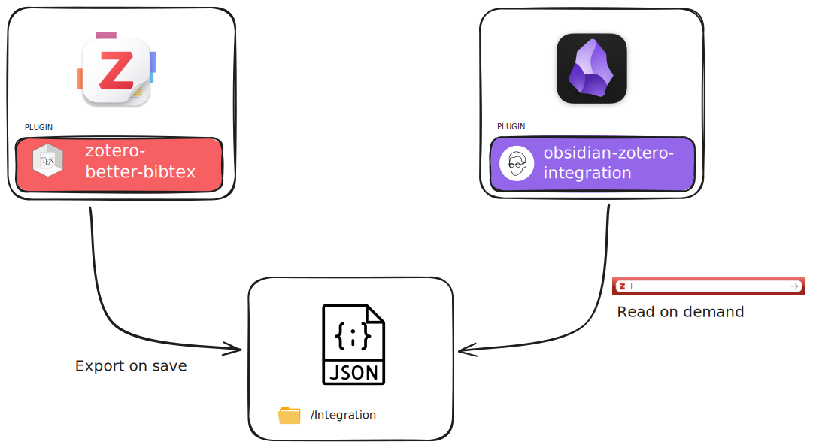

The integration works through these key components:
- **Zotero with Better BibTeX plugin:** Exports your library to a JSON file whenever changes are made
- **Shared JSON file:** Acts as the bridge between both applications, storing all your reference data
- **Obsidian with Zotero Integration plugin:** Reads the JSON file to access your references within your notes

This setup allows you to maintain your research library in Zotero while seamlessly citing and referencing sources in your Obsidian notes.

## Prerequisites

Before starting, ensure you have both Zotero and Obsidian installed on your system.

## Step 1: Create Integration Folder

Create a dedicated folder to store the integration files:
- Create a new folder named `Integration`
- **Recommended location:** Place it near your Obsidian vault or Zotero folder for easy access
- This folder will contain the shared reference file between both applications

## Step 2: Install Better BibTeX Plugin for Zotero

### Download the Plugin

1. **Visit the official plugin page**
   - Go to [https://retorque.re/zotero-better-bibtex/installation/](https://retorque.re/zotero-better-bibtex/installation/index.html)

   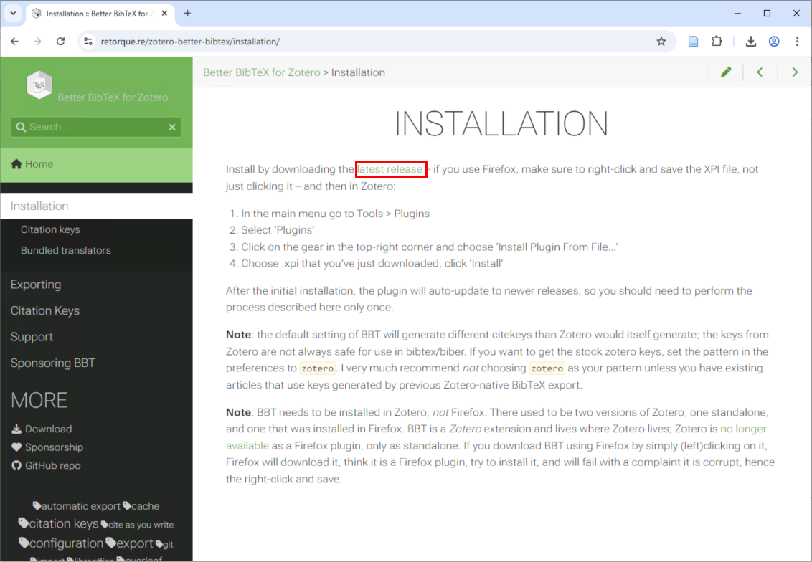

2. **Download the plugin file**
   - Scroll to the bottom of the GitHub page
   - Download the `.xpi` plugin file

   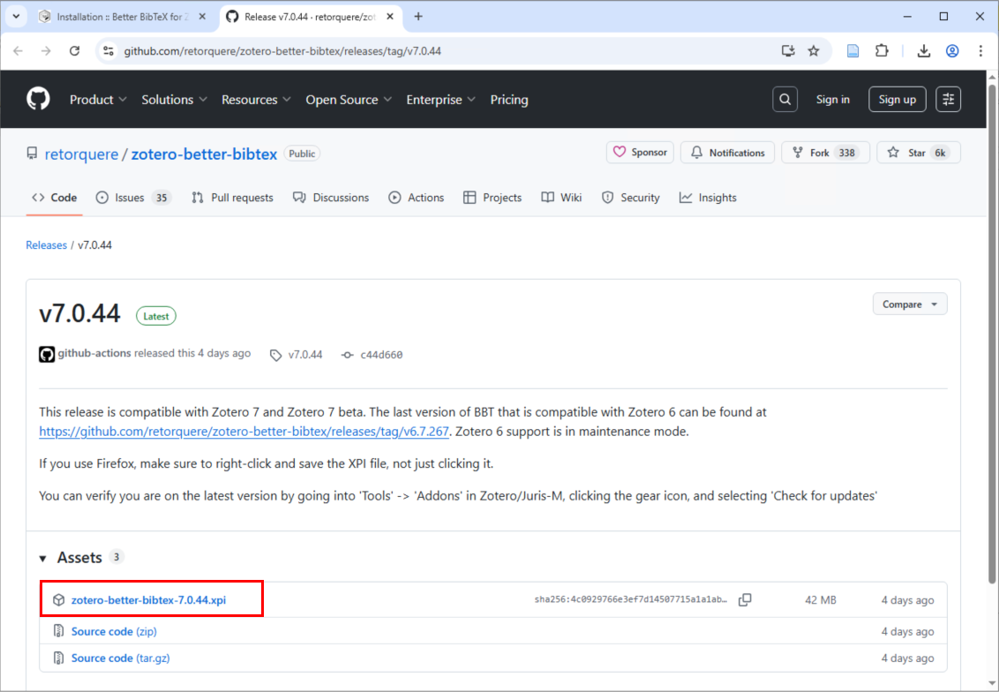

### Install the Plugin in Zotero

3. **Open Plugin Manager**
   - In Zotero, navigate to `Tools > Plugins`

   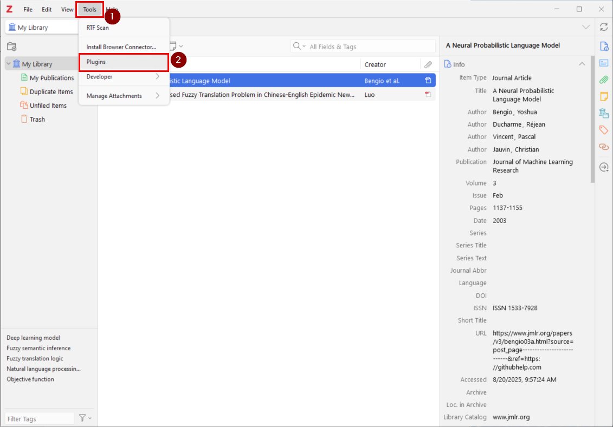

4. **Install from file**
   - Click the settings cog icon on the right
   - Choose `Install Plugin From File`
   - Select the downloaded `.xpi` file

   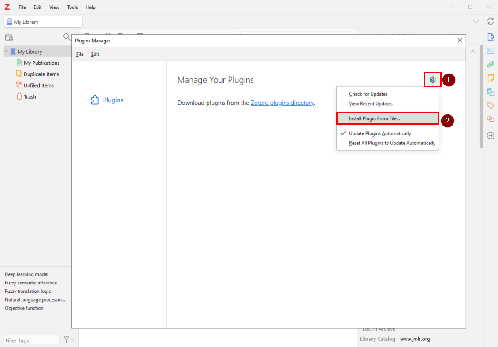

5. **Enable the plugin**
   - Ensure the Better BibTeX plugin is enabled
   - Close the Plugin Manager

   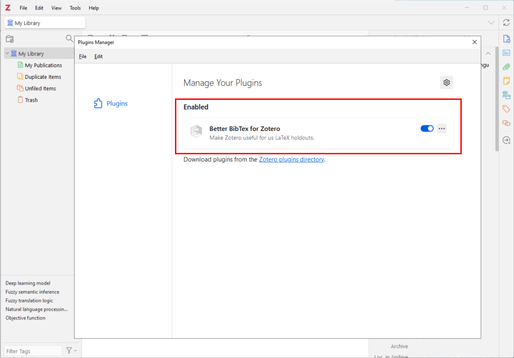

## Step 3: Configure Citation Keys

1. **Access Better BibTeX settings**
   - Navigate to `Edit > Settings` 
   - Find the Better BibTeX tab

2. **Review Citation Key format**
   - The Citation Key format defines the components of the unique key generated for each reference and gets carried across from Zotero into Obsidian
   - **Recommendation:** Keep the default format unless you have specific requirements
   - Other default settings work well for most users

   

## Step 4: Export Zotero Library

This step creates the bridge file that connects Zotero to Obsidian.

> **Note:** This export only needs to be done once. Zotero will automatically update the file whenever you add or modify references.

1. **Start the export**
   - Right-click on `My Library` in Zotero
   - Select `Export Library...`

   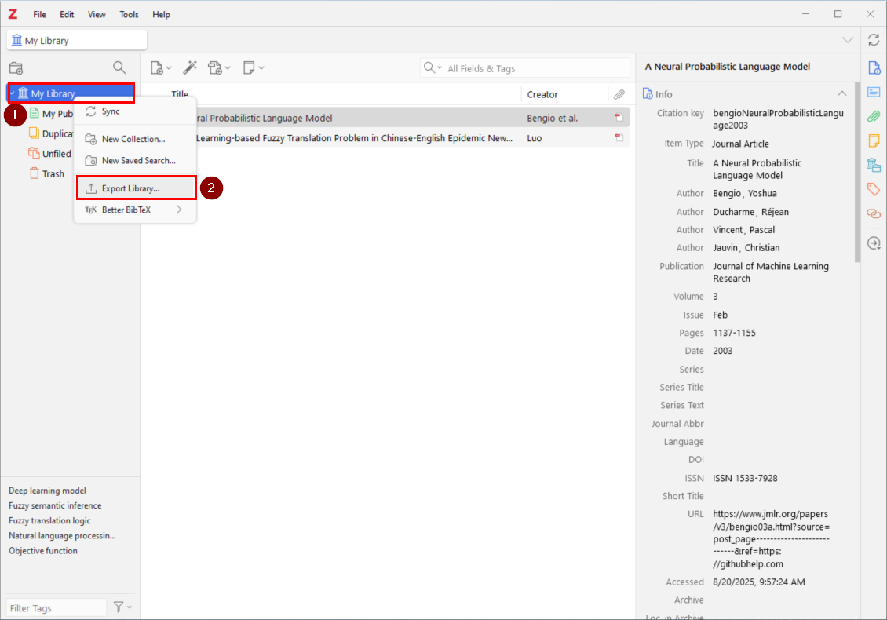

2. **Choose export location**
   - Navigate to the `Integration` folder you created earlier

   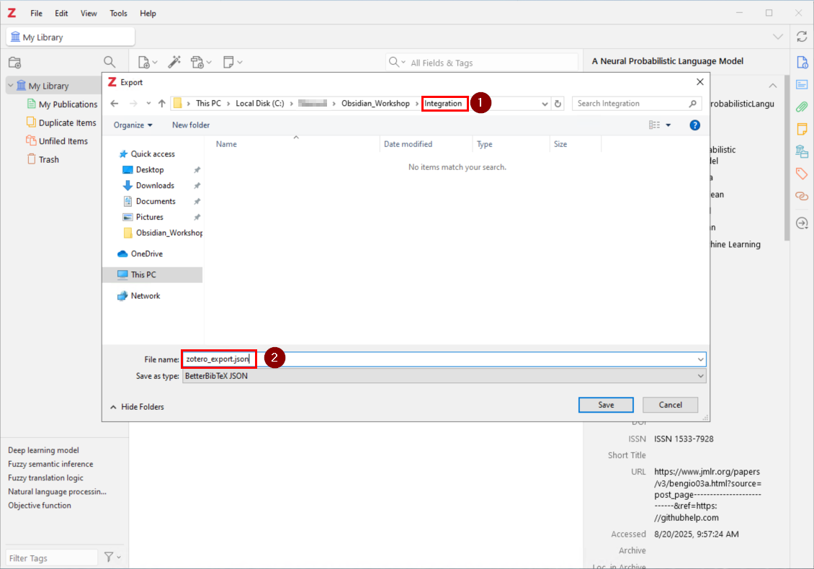

3. **Configure export settings**
   - **Format:** Select `Better BibTeX JSON`
   - **✓ Keep updated:** This ensures the file stays synchronized with your Zotero library
   - Click `OK` to complete the export

   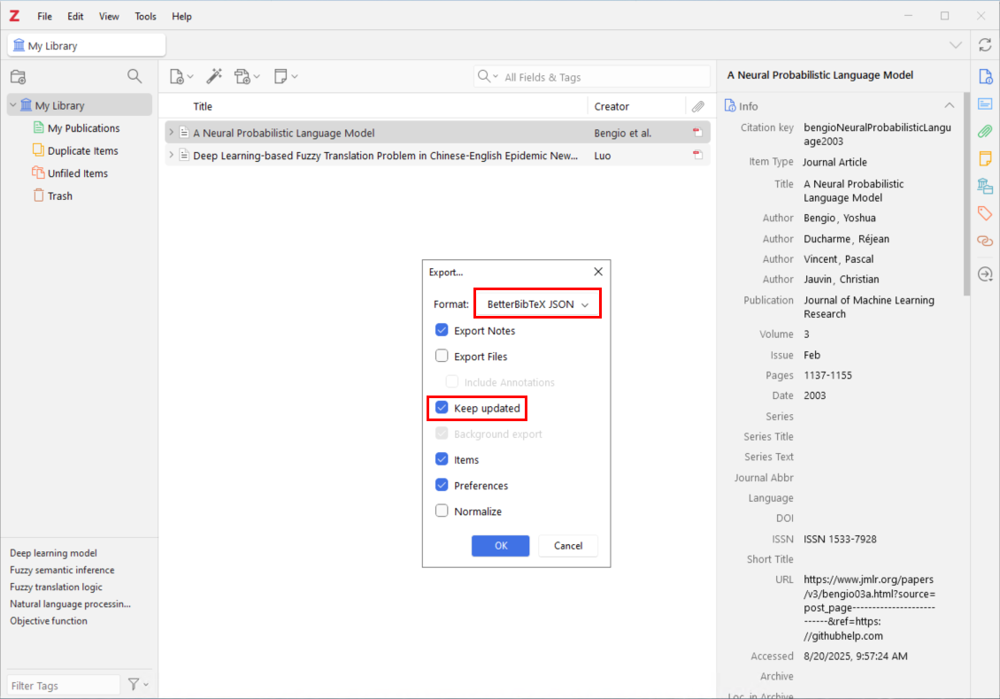

## Step 5: Install Zotero Integration Plugin for Obsidian

### Enable Community Plugins

1. **Access Obsidian settings**
   - Ensure Community Plugins are enabled in your Obsidian settings

   

### Install the Plugin

2. **Browse community plugins**
   - Navigate to `Community Plugins`
   - Click `Browse`

   

3. **Find Zotero Integration**
   - Search for `Zotero Integration` plugin

   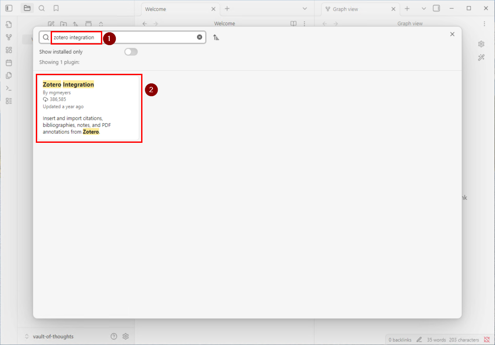

4. **Install the plugin**
   - Click `Install` to add the plugin to Obsidian

   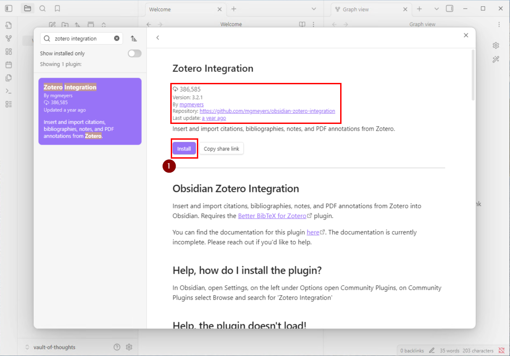

## Step 6: Configure the Obsidian Plugin

After installation, you'll need to:
- Enable the Zotero Integration plugin
- Point it to your exported JSON file in the Integration folder
- Configure citation templates (optional)

