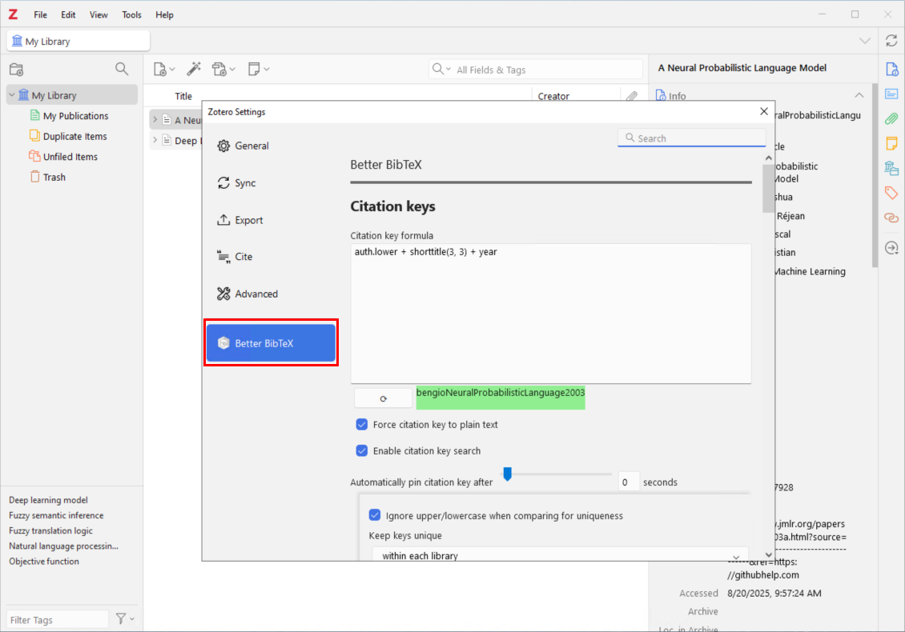
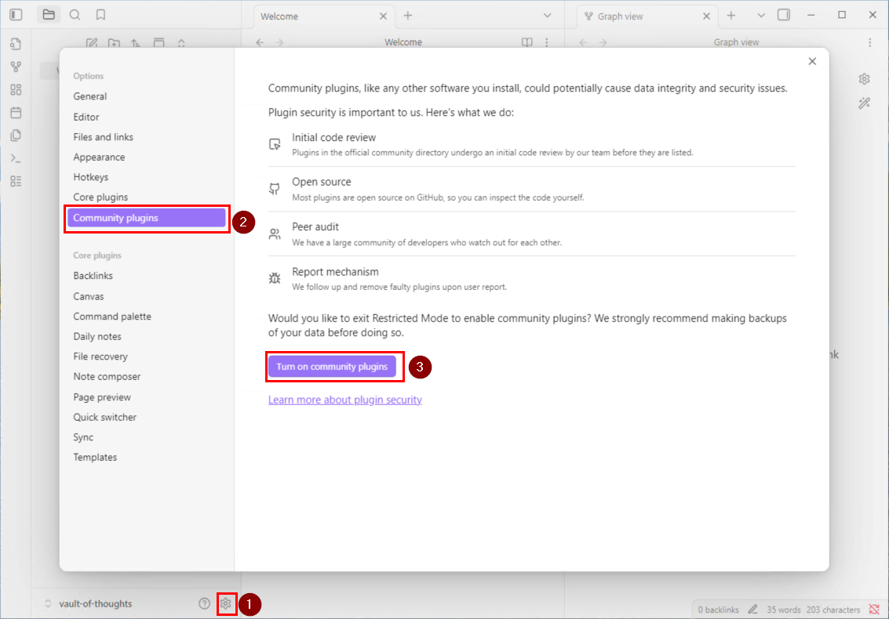

# Obsidian Zotero Integration on Windows

- First thing we want to do is create a folder to store our integration file `\Integration`. Recommend keeping it close to your obsidian vault or zotero folder.

### Install Zotero Plugin - Better BibTex for Zotero

- Navigate and download the Better BibTex for Zotero plugin from the official website https://retorque.re/zotero-better-bibtex/installation/index.html.

- The plugin file (.xpi) file is located at the bottom of the github page.

- Back in Zotero navigate to `Tools > Plugins` to open the Plugin Manager

- From the right hand side click the settings cog and choose `Install Plugin From File`

- Once the plugin is installed ensure it is enabled then close the Plugin Manager screen.

### Configure Citation Key
- Navigate to `Edit > Settings` and locate the Better BibTex tab
- You can modify the Citation Key format from here which will be used as your primary key to link between Zotero and Obsidian. Recommend leaving it as is.
- No need to change any other settings unless you are having issues. The default values work pretty well.

### Initial Export
- An initial export of the BibTex file is required. 
- You only need to do this step once, after that, Zotero will keep the reference file and keep it up to date with any additions or changes you make.
- Right click on the `My Libraray` node
- Pick `Export Library...`

- Locate the integration folder set up at the begining of this guide.

- Pick the format as `BetterBibTeX JSON`
- Tick `Keep updated` checkbox
- Click `OK`

### Install Obsidian Plugin - Zotero Integration
- Navigate to settings and first ensure that community plugins are turned on 

- Next navigate to `Community plugins` and click `Browse`

- Locate the `Zotero Integration` plugin

- Click `Install` to install the plugin

