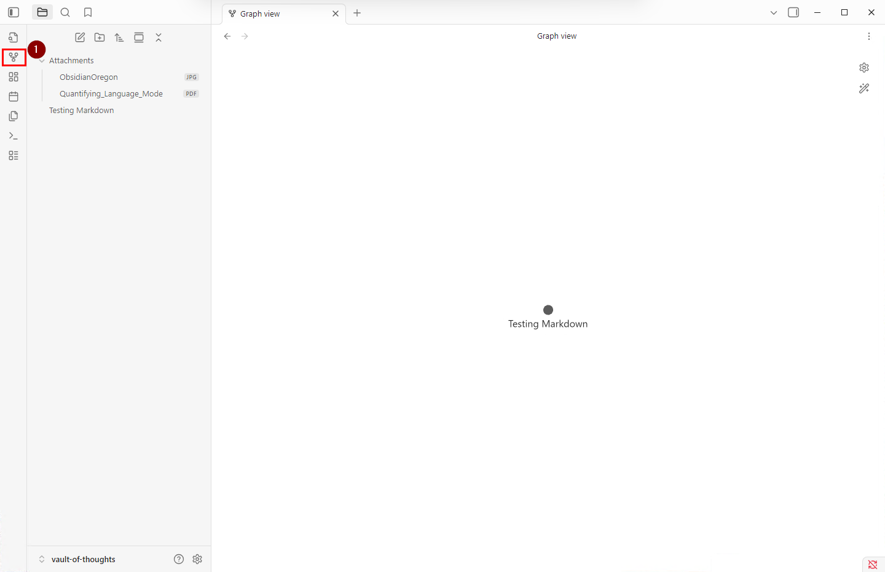
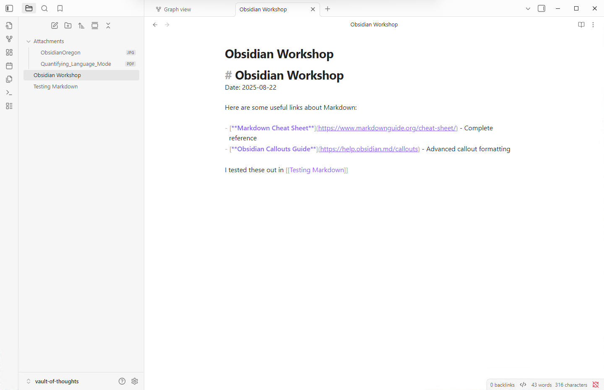
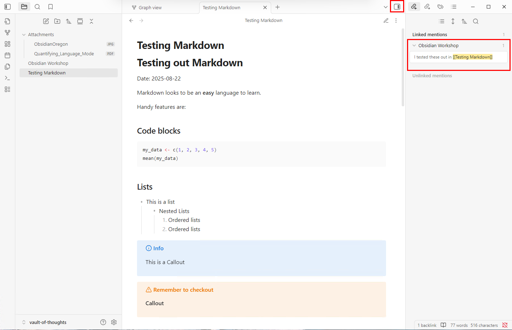
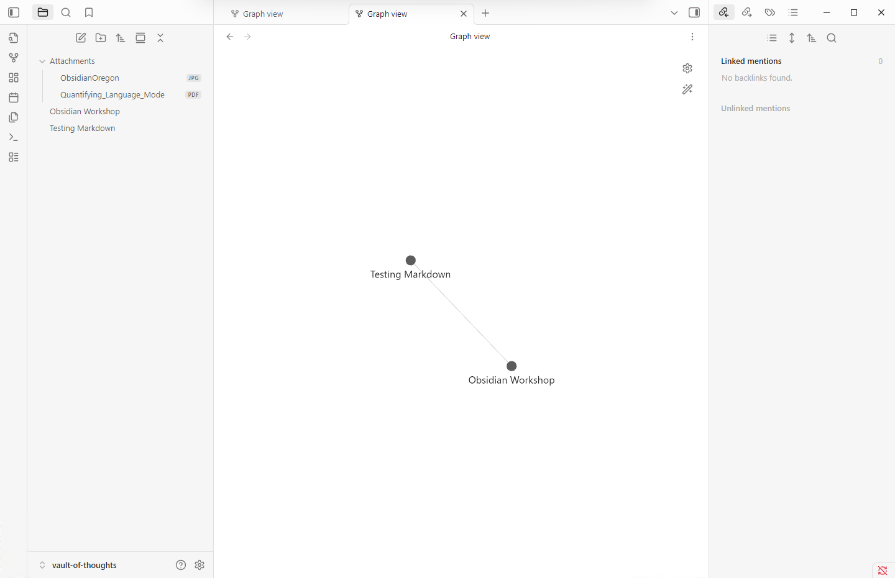
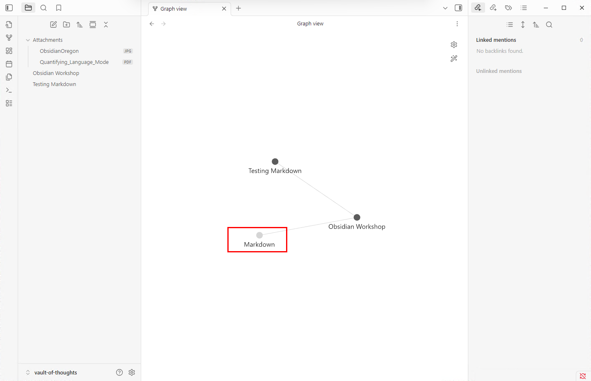
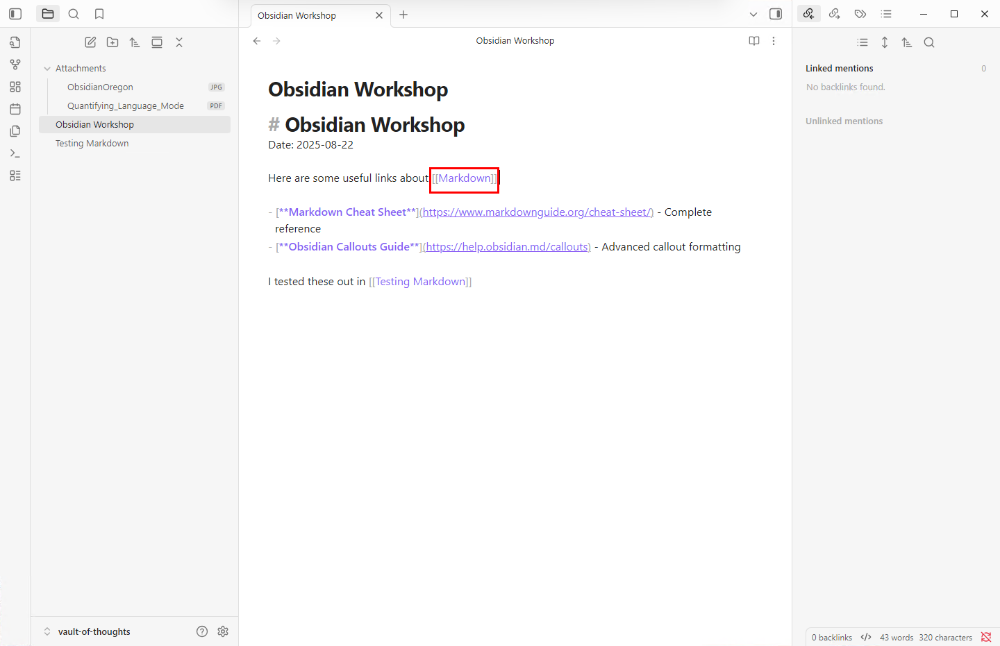
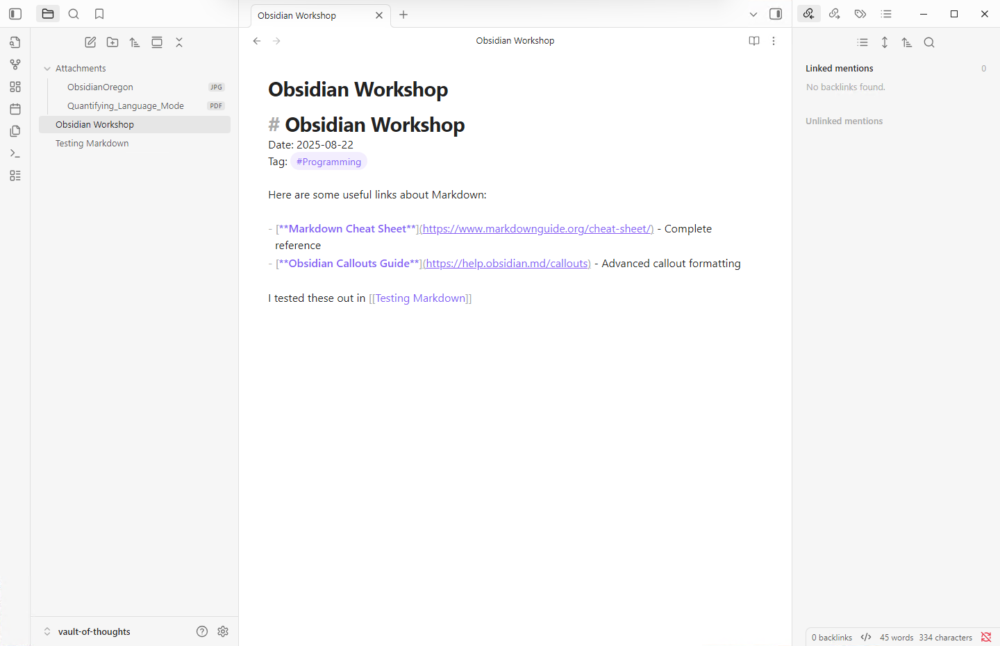
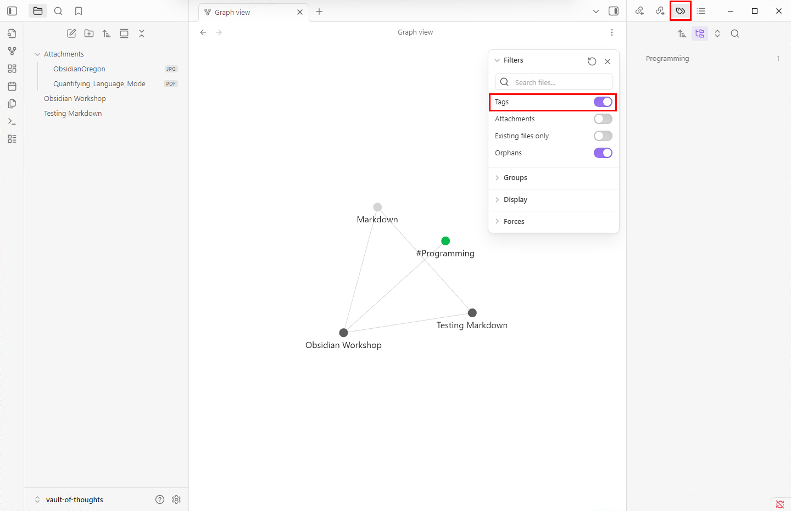

# Linking and Tagging Notes in Obsidian

This section explores Obsidian's most powerful feature: connecting your thoughts and ideas through links and tags.

## Visualizing Your Knowledge Network

The real power of Obsidian lies in linking insights together across your notes. Let's see this in action.

### Graph View Introduction

1. **Open Graph View** from the sidebar or command palette
2. Currently, with only one note, you'll see a single node

> **What you're seeing:** Each note becomes a node in your knowledge graph. As you create links, you'll see connections form between these nodes.

## Creating Your First Link

Let's create a second note to demonstrate linking:

### Create a Reference Note

1. **Create a new note** called `Obsidian Workshop`
2. **Add the current date** at the top
3. **Copy the learning resources** from our previous Markdown guide [Learning Resources](./Markdown_Walk_Through.md#learning-resources).

### Making the Connection

Now let's create a link between notes:

1. **Add a reference** like: *"I tested some of these concepts in [[Testing Markdown]]"*
2. **Notice:** The double square brackets `[[]]` create the link

### Navigating Your Links

Switch to **Reading View** to see how links work:

**You can now:**
- **Click the link** to navigate to that note
- **Use the sidebar** to see all backlinks (notes that link to the current note)
- **Navigate back** by clicking on backlink entries

### Seeing the Network Grow

Check your **Graph View** again:

You now see two connected nodes representing your linked notes!

## Creating Links to Non-Existent Notes

One of Obsidian's powerful features is linking to notes that don't exist yet:

1. **Type any concept** in double brackets, like `[[Markdown]]`
2. **Check Graph View** - you'll see it as a new node

### Building Your Network

**Try this:** Go back to your "Testing Markdown" note and put any occurrences of "Markdown" into double square brackets `[[Markdown]]`. Check the Graph View to see the new connections.

### Working with Placeholder Links

**Notice:**
- **Faded links** = Notes that don't exist yet
- **Clicking a faded link** = Creates the note automatically
- This lets you build your knowledge structure first, then fill in the details

## Tags

Tags provide a different way to organize your notes - think of them as categories or labels.

### Creating Tags

To create a tag, simply put a `#` in front of a word:

1. **Add a tag** like `#Programming` to your note

2. **Tags can be hierarchical** - `#Programming/Markdown` is a valid tag. When you apply a tag to another note you can choose the prefered level.

### Tags vs. Links: Key Differences

| Feature | Links `[[]]` | Tags `#` |
|---------|-------------|----------|
| **Purpose** | Connect to specific notes | Categorize and group notes |
| **Content** | Point to actual notes with content | No associated content |
| **Clicking behavior** | Opens the linked note OR creates it if missing | Opens search showing all notes with that tag |
| **Updates** | Automatically update when source file is renamed | Require manual find-and-replace to update |

### Practical Use Cases

**Use Links when:**
- Referencing specific notes or concepts
- Building direct relationships between ideas
- Creating a web of connected thoughts

**Use Tags when:**
- Categorizing notes by topic, project, or status
- Creating broad organizational themes
- Making notes searchable by category

## Visualizing Tags in Your Graph

You can see tags in your knowledge graph.

**To enable tag visualization:**
1. **In Graph View:** Click the settings cog
2. **Enable "Tags"** in the options
3. **Alternative:** View tags in the sidebar using the tag panel icon

## Key Behaviors to Remember

### Link Behavior
- **Existing note:** Opens the note
- **Non-existent note:** Creates the note when clicked
- **Automatic updates:** Links update when you rename files

### Tag Behavior  
- **Clicking a tag:** Opens search results for that tag
- **Manual maintenance:** Tags don't auto-update if you change them
- **Searchable:** All tagged notes are easily findable
