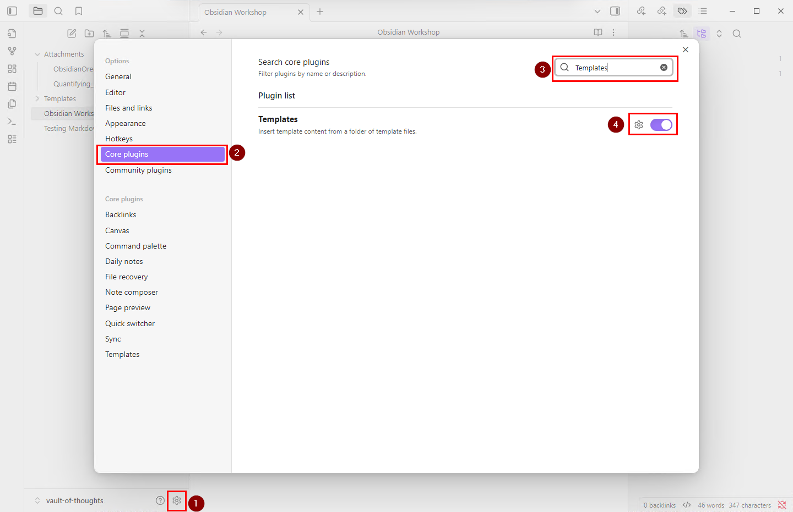
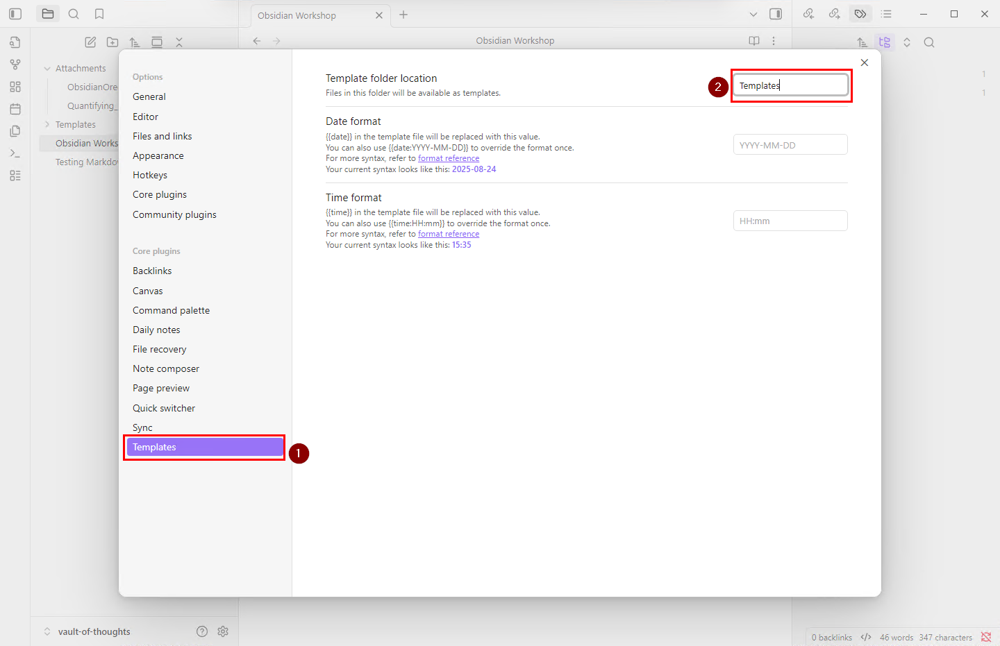
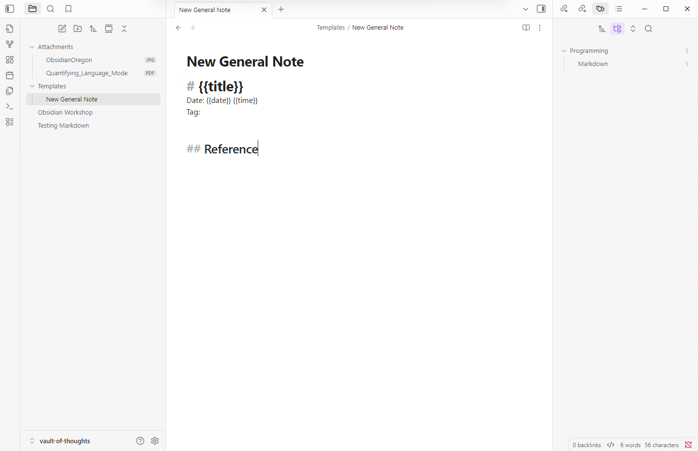
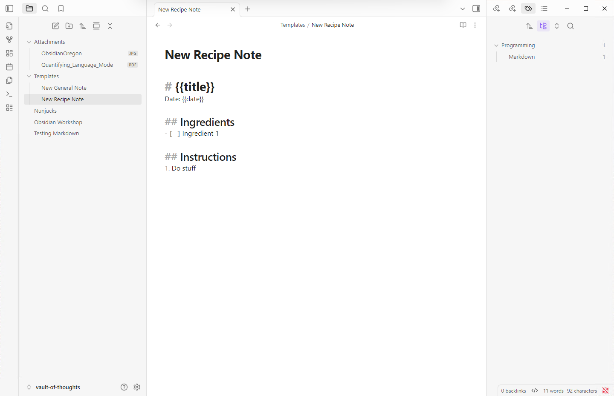
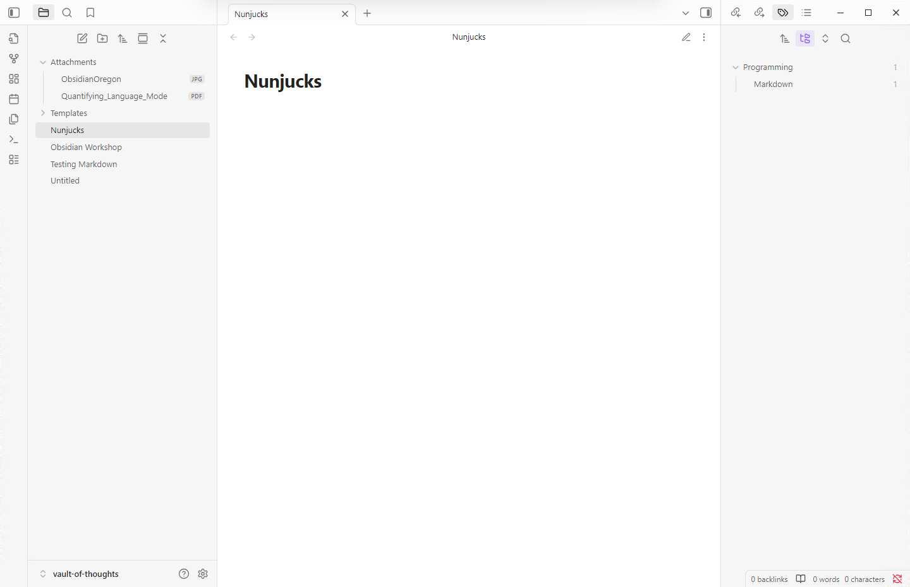
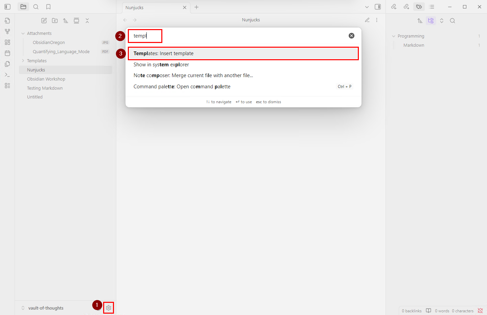
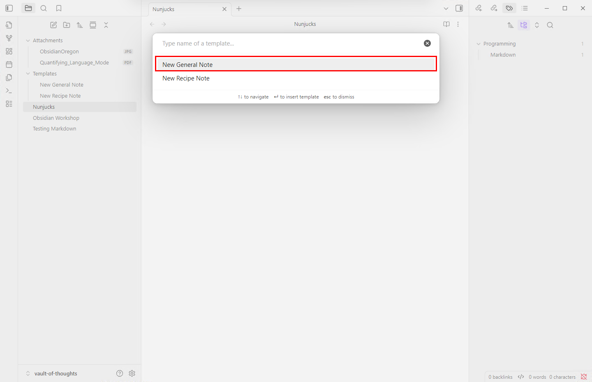
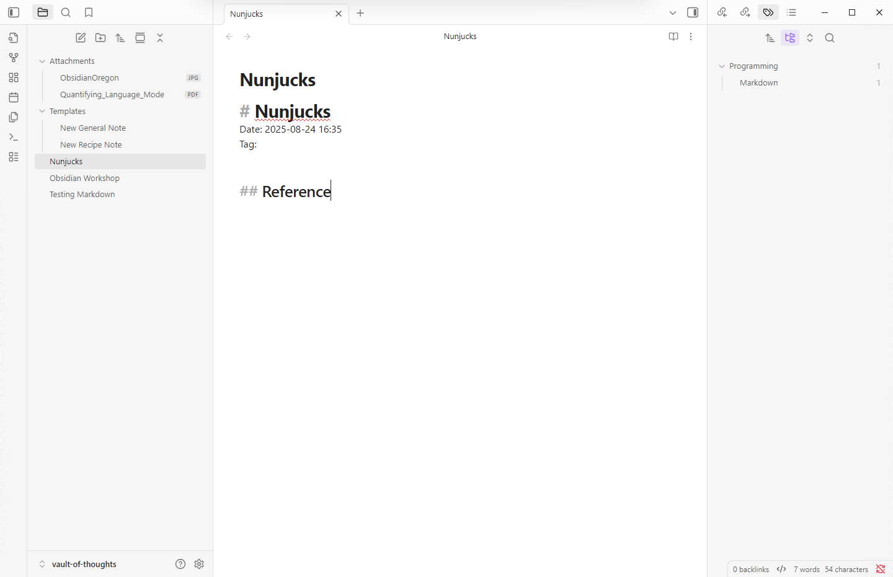
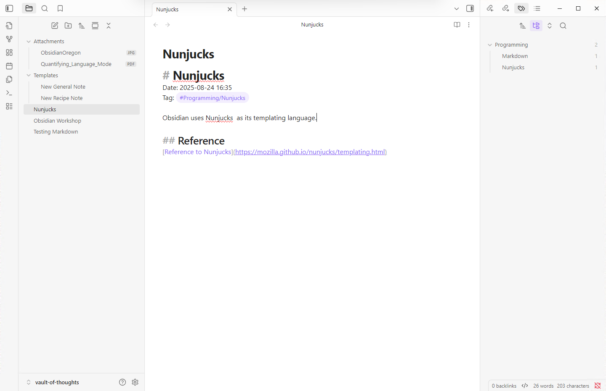
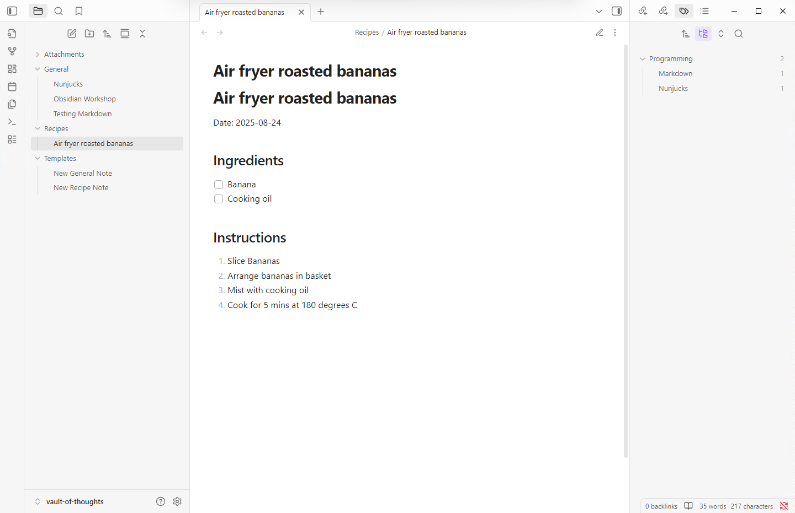

# Using Templates for Efficient Note Creation

## What Are Templates?

Templates are pre-built note structures that provide a skeleton for your notes. Instead of recreating the same format repeatedly, you can instantly apply a template and fill in the details.

### Templating Language

Obsidian uses [Nunjucks](https://mozilla.github.io/nunjucks/templating.html) as its templating language, which allows for more advanced features with community plugins. We will see this in action with the Zotero integration.

## Setting Up Templates

### Create a Templates Folder

First, let's organize our templates:
1. **Create a new folder** called `Templates`
2. This keeps all your templates organized in one place

### Enable the Templates Core Plugin

Templates are a built-in Obsidian feature that needs to be activated:

1. **Go to Settings** ⚙️
2. **Navigate to Core plugins**
3. **Enable "Templates"**

### Configure Template Location

Tell Obsidian where to find your templates:

1. **In Settings**, find the **Templates** section
2. **Set Template folder location** to: `Templates`

## Creating Your First Template

Let's create a general-purpose note template:

### Build a General Note Template

1. **Right-click** on the `Templates` folder
2. **Select "New note"**
3. **Name it:** `New General Note`

**Design the template structure** based on common elements we've used:
- Title placeholder
- Date and time
- Tag section

Let's also add a reference section.

### Understanding Template Placeholders

The core Templates plugin provides three built-in placeholders:

- `{{title}}`: Inserts the title of the active note
- `{{date}}`: Inserts the current date (format customizable in settings)
- `{{time}}`: Inserts the current time (format customizable in settings)

> **Note:** Additional placeholders become available when you install community plugins.

### Create a Second Template

To demonstrate the verstility of templates we will create another template to store recipes.

**Create a Recipe Note template:**

1. **Create another note** in Templates folder: `New Recipe Note`
2. **Copy content** from the general template
3. **Customize** for recipe-specific needs (ingredients, instructions, etc.)

## Using Templates

Now let's put our templates to work:

### Apply a Template to a New Note

1. **Create a new note** and give it a name (e.g., "Nunjucks")
> MAKE SURE TO BE IN SOURCE MODE

2. **Open Command Palette** (`Ctrl+Shift+P` or `Cmd+Shift+P`)
3. **Search for and select** "Insert template"

4. **Choose your template** (e.g., "New General Note")

5. **Template fields are automatically inserted!**
- The title placeholder is replaced
- Current date and time are automatically filled
- You have a structured starting point for your content

### Complete Your Note

Fill out the template with actual content:

## Try it out!

**Try the recipe template:**
1. Create a new note for a favorite recipe
2. Apply the "New Recipe Note" template
3. Fill in the recipe details

### Organizing Your Vault

As your vault grows, consider creating folders for different note types:

## Benefits of Using Templates

**Consistency:** All notes of the same type follow the same structure
**Speed:** No need to recreate common elements
**Focus:** Spend time on content, not formatting
**Organization:** Built-in structure encourages better note-taking habits
