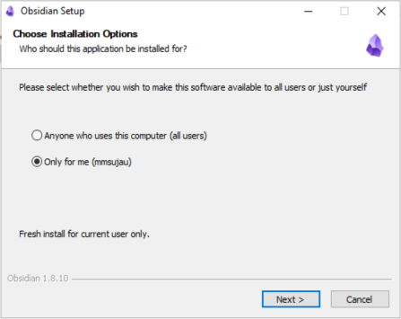
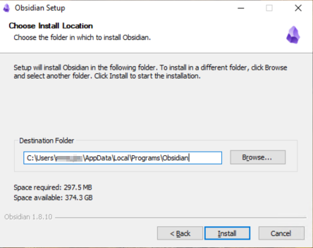
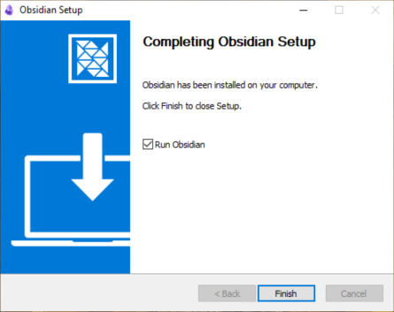
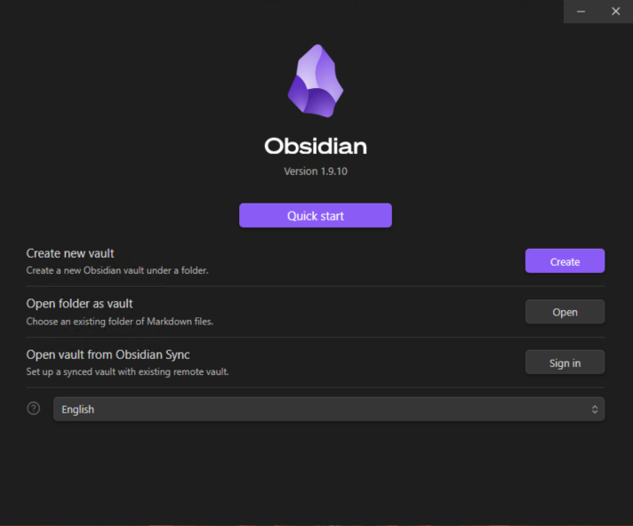

# Installing Obsidian on Windows

## Download Obsidian

1. Visit the official Obsidian website at [https://obsidian.md/download](https://obsidian.md/download)
2. Select the installer for your operating system.

## Installation Steps

1. **Run the installer** and choose your installation scope:
   - Install for current user only (recommended for personal use)
   - Install for all users on the computer (requires administrator privileges)

   

2. **Select installation directory** 
   - Choose your preferred location or keep the default directory

   

3. **Complete the installation**
   - The installer will finish setting up Obsidian on your system

   

4. **Launch Obsidian**
   - Once installation is complete, you'll see the welcome screen
   - You're now ready to start using Obsidian!

   
