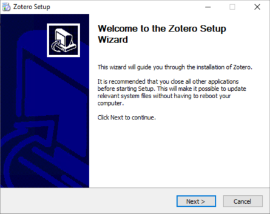
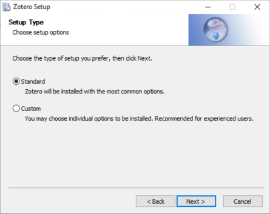
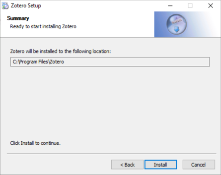
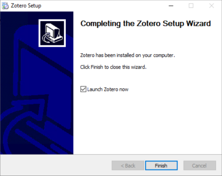
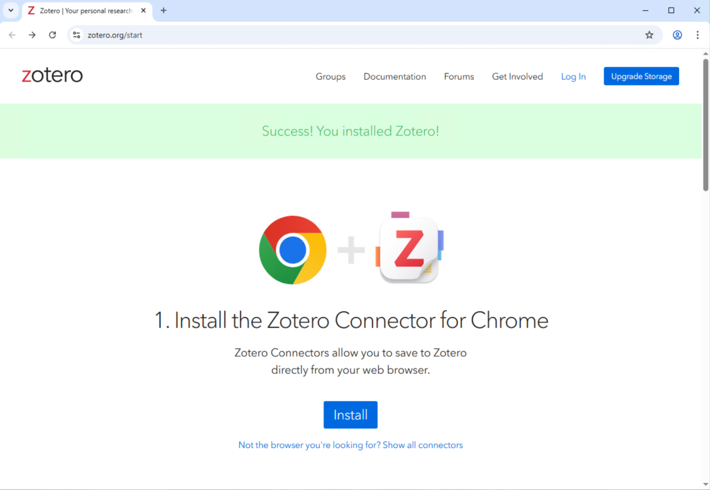
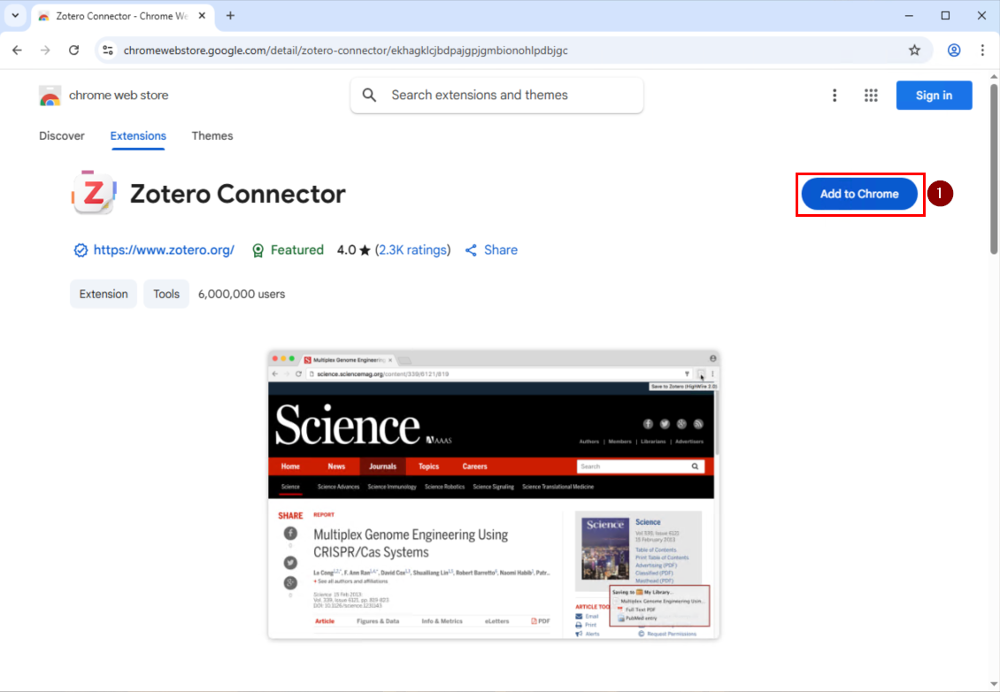
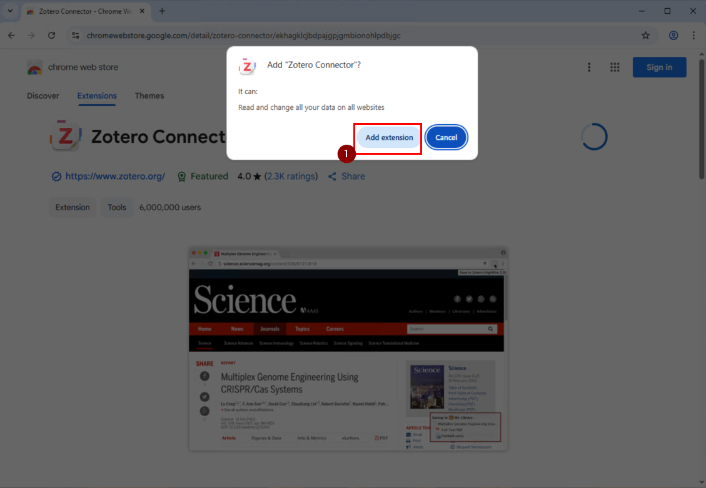
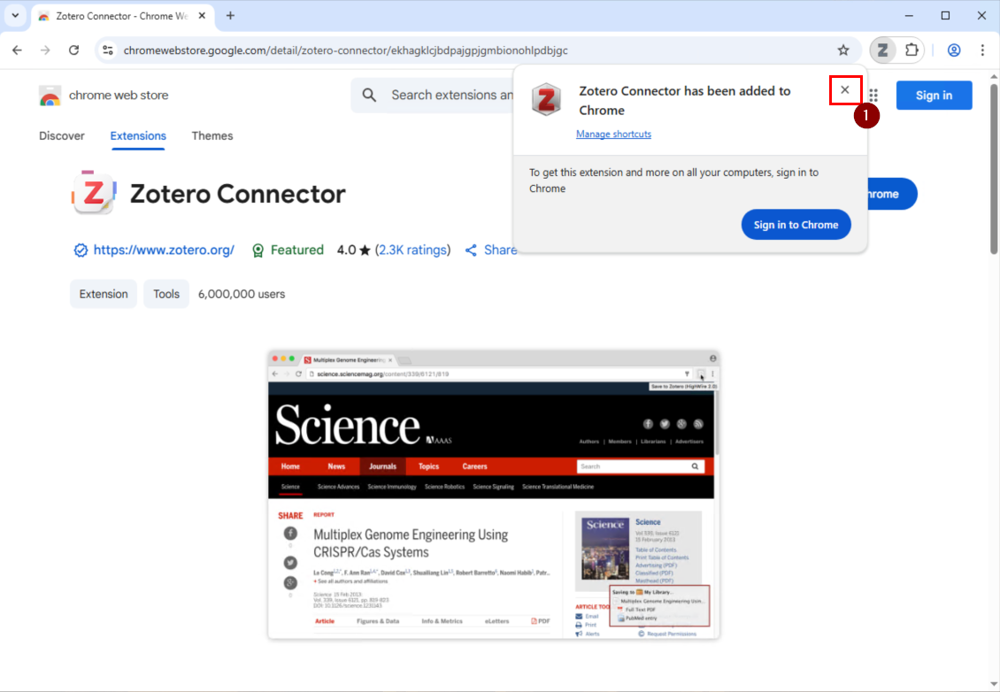
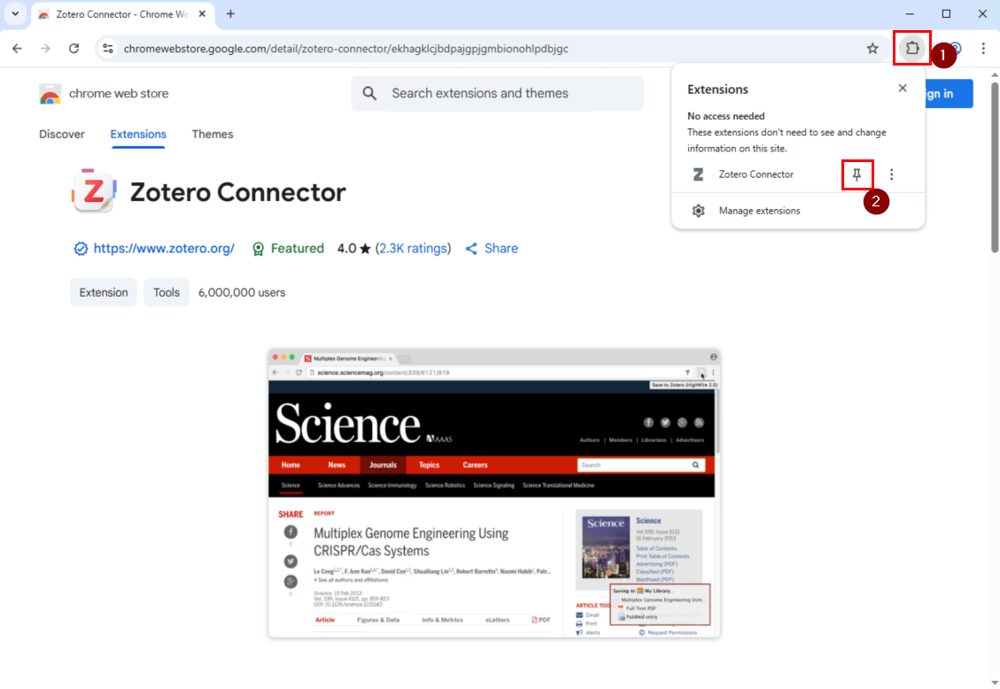
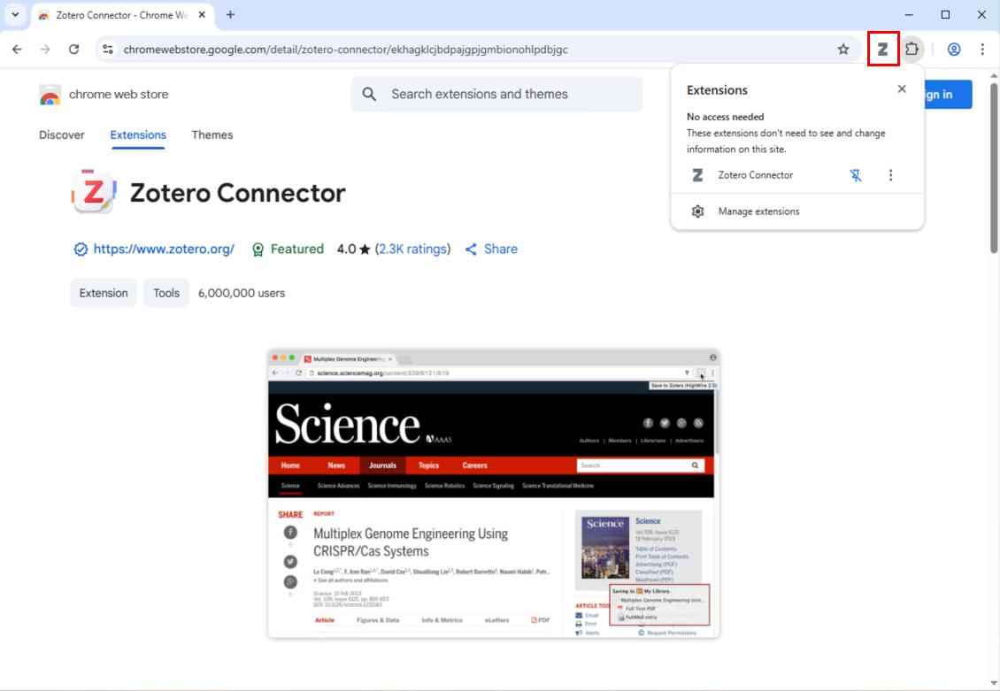

# Installing Zotero on Windows

## Download Zotero

1. Visit the official Zotero website at [https://www.zotero.org/](https://www.zotero.org/)
2. Select the Windows installer for your system

## Installation Steps

1. **Run the installer**
   - Launch the downloaded Zotero installer

   

2. **Choose installation type**
   - Select between Standard installation (recommended) or Custom installation for advanced users

   

3. **Select installation directory** 
   - Choose your preferred location or keep the default directory

   

4. **Complete the installation**
   - The installer will finish setting up Zotero on your system

   

## Installing the Zotero Browser Extension (Chrome)

The Zotero browser extension allows you to save references directly from web pages while browsing.

### Download and Install

1. **Visit the browser extensions page**
   - Go to [https://www.zotero.org/start](https://www.zotero.org/start)
   - Click "Install" for your browser

   

2. **Add to Chrome**
   - Click "Add to Chrome" in the Chrome Web Store

   

3. **Review permissions**
   - **Important:** The extension requests access to all websites to detect research content
   - Consider the privacy implications before proceeding
   - Click "Add extension" to continue

   

### Configure the Extension

4. **Access the extension**
   - You do NOT need to be signed into Chrome to use the extension.
   - Click on the plugin extension icon in your browser toolbar

   

5. **Pin to toolbar (recommended)**
   - Pin the Zotero extension to your toolbar for easy access
   - This ensures the icon is always visible

   

## Using the Browser Extension

6. **Save content from web pages**
   - The Zotero icon changes based on content type (journal articles, preprints, conference papers, websites)
   - Click the icon to save the current page's bibliographic information to your Zotero library

   
