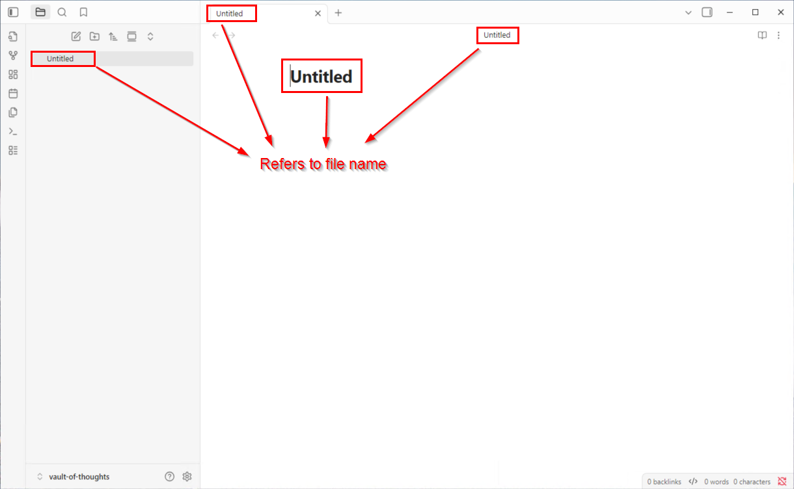
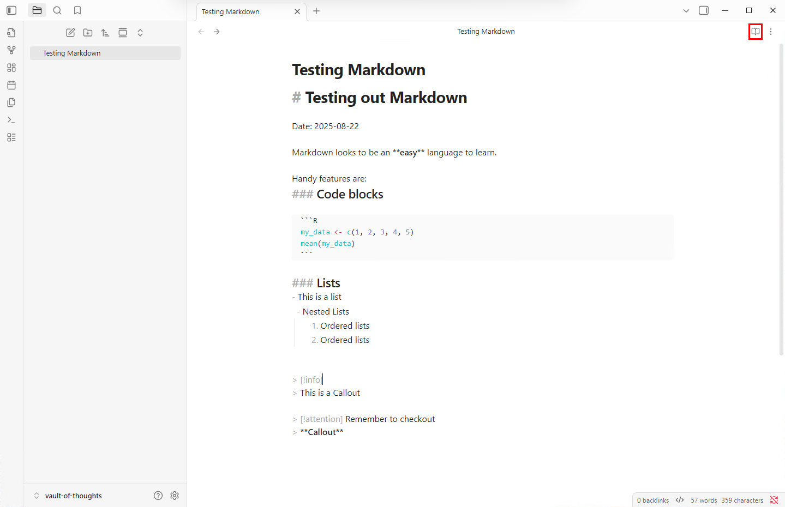
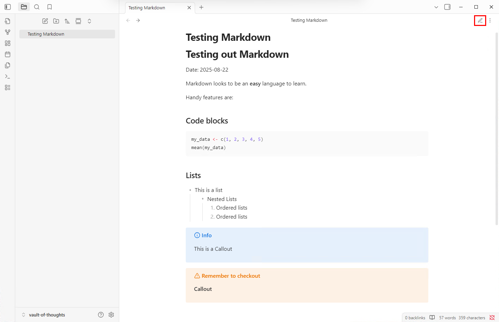
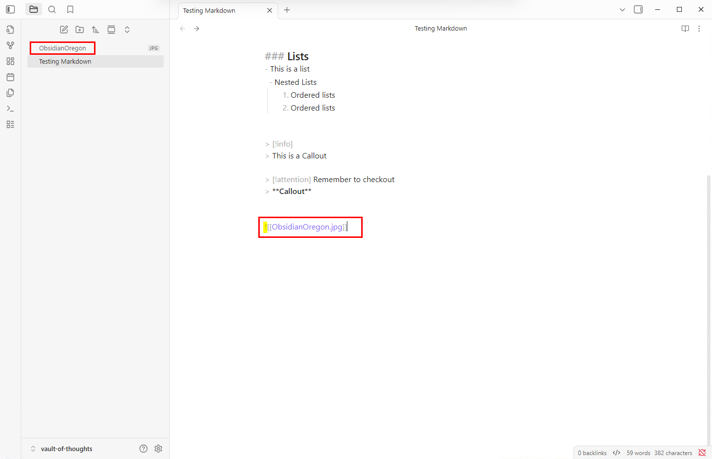
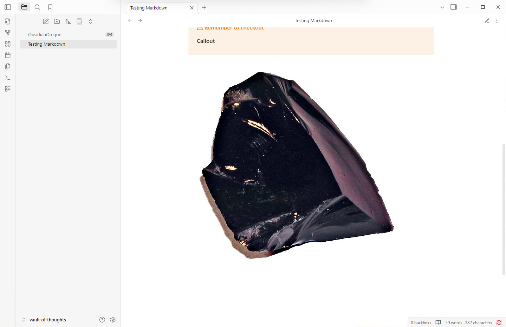
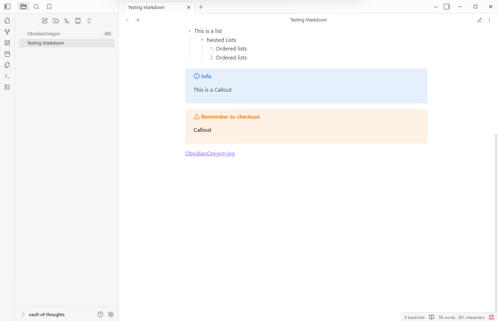
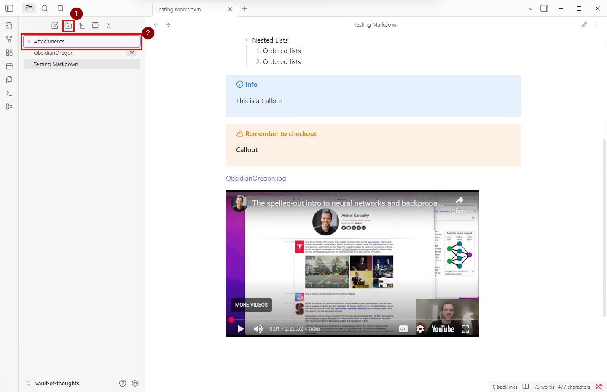
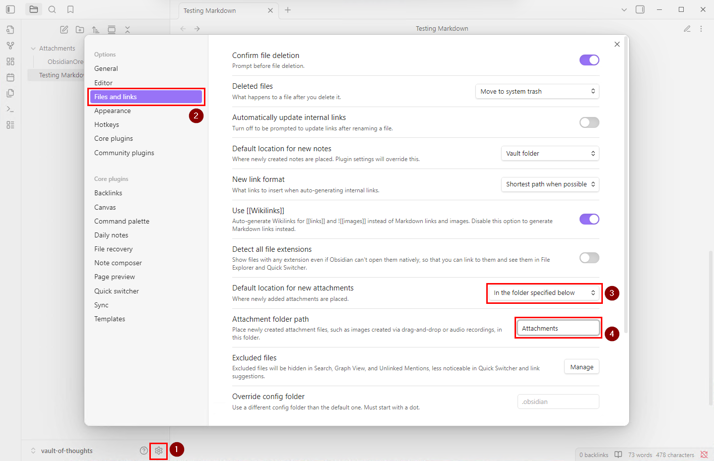
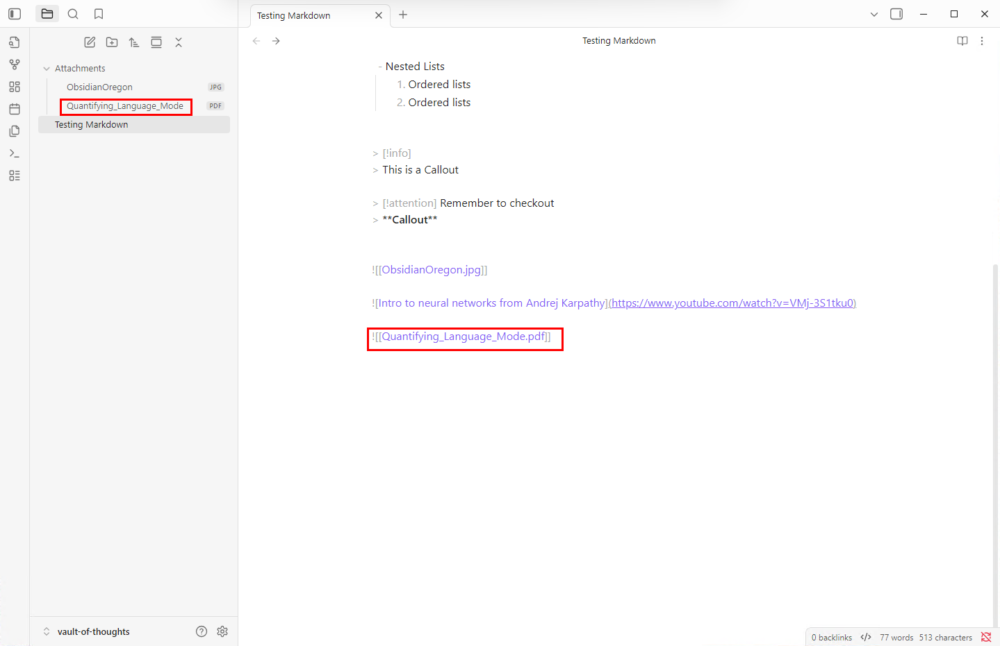
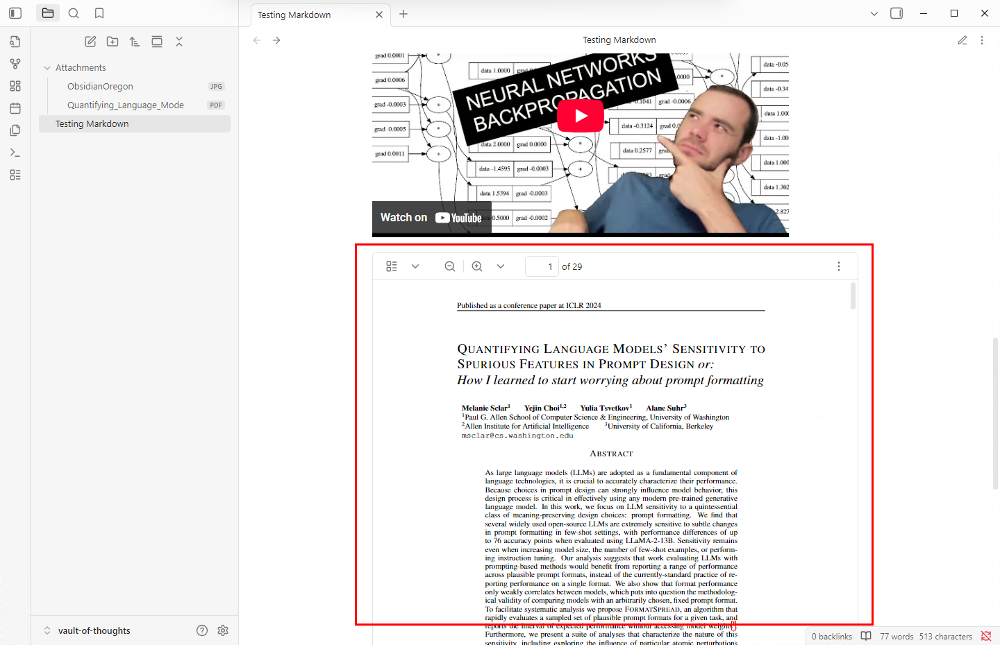

# Creating Notes with Markdown in Obsidian

This section covers the basics of creating and formatting notes using Markdown syntax.

## Starting Fresh

First, let's clean up the workspace:
1. **Delete the default Welcome note**
   - Right-click on the "Welcome" note
   - Choose **"Delete"** from the context menu
2. You now have a completely blank canvas to work with

## Creating New Notes

There are several ways to create a new note in Obsidian:

- **Toolbar:** Click the **"New note"** icon
- **Tab strip:** Click the **"+"** button and select **"Create new note"**
- **Command Palette:** Open with `Ctrl+Shift+P` (Windows) or `Cmd+Shift+P` (Mac), then find **"Create new note"**
- **Keyboard shortcut:** `Ctrl+N` (Windows) or `Cmd+N` (Mac)

## Understanding Note Names

When you create a new note, it's called "Untitled" by default. This filename appears in four places:



**Important:** If you change the text in any of these locations, the filename changes automatically.

### File Naming Best Practices
- Use typical file naming conventions
- Avoid special characters like quotes, slashes, or colons
- Keep names descriptive but concise

**For this workshop:** Let's name our first note **"Testing Markdown"**

## Basic Markdown Formatting

Now let's explore essential Markdown syntax:

### Headers
- `#` = Main heading (H1)
- `##` = Subheading (H2)  
- `###` = Sub-subheading (H3)
- Continue adding `#` symbols for deeper levels

### Text Formatting
- `**bold text**` = **bold text**
- `*italic text*` = *italic text*
- `***bold and italic***` = ***bold and italic***

### Useful Features
- **Code blocks:** Use three backticks ``` for code
- **Lists:** Use `-` or `*` for bullet points, numbers for ordered lists
- **Callouts:** Special boxes for highlighting information

### Learning Resources
- [**Markdown Cheat Sheet**](https://www.markdownguide.org/cheat-sheet/) - Complete reference
- [**Obsidian Callouts Guide**](https://help.obsidian.md/callouts) - Advanced callout formatting

## Viewing Your Work

Let's see how our note looks in both modes:

**Source Mode** (raw Markdown):



**Reading Mode**:



> **Workshop Tip:** Toggle between these views frequently to see how your formatting appears.

## Working with Attachments

### Adding Images

**Drag and Drop**
1. Switch to **Source mode**
2. Drag an image file into your note
3. Obsidian automatically:
   - Copies the image next to your note
   - Creates a link using `![[filename]]` syntax



**In Reading Mode, the image renders:**



### Understanding Link Syntax

- `![[filename]]` = **Embedded content** (images, PDFs show inline)
- `[[filename]]` = **Regular link** (clickable text only)

**Example of regular link** (without the `!`):



### Embedding YouTube Videos

Try this: Copy and paste this code into your note in Source mode:
> **Tip:** Remeber to delete any `code block` syntax after you paste the link 

```markdown

```

Toggle to Reading view to see the embedded video player.

## Organizing Your Vault

### Creating Folder Structure

As your vault grows, organization becomes important. Let's create an **"Attachments"** folder:

- **Toolbar:** Click **"New folder"** icon
- Simply **drag and drop** the image file into the folder



**Important:** Notice that even after moving the image, the link in your note still works! Obsidian automatically updates internal links.

## Setting Default Attachment Behavior

Instead of manually organizing attachments each time, let's automate this:

### Configure Attachment Settings

1. Go to **Settings** ⚙️
2. Navigate to **"Files and links"**
3. Find **"Default location for new attachments"**
4. Select **"In the folder specified below"**
5. Set **"Attachment folder path"** to: `Attachments`



## Testing the New Setup

Let's verify our settings work with a PDF:

### Adding a PDF File

1. **Switch to Source mode**
2. **Drag and drop** a PDF file onto your note
3. **Observe:** 
   - File automatically goes to the Attachments folder
   - Link appears as `![[filename.pdf]]`



### Viewing the PDF

Switch to **Reading mode** to see the PDF rendered inline:



## What's Next

You now have the fundamentals for creating rich, well-organized notes in Obsidian. In the next section, we'll explore linking between notes to create a knowledge network.