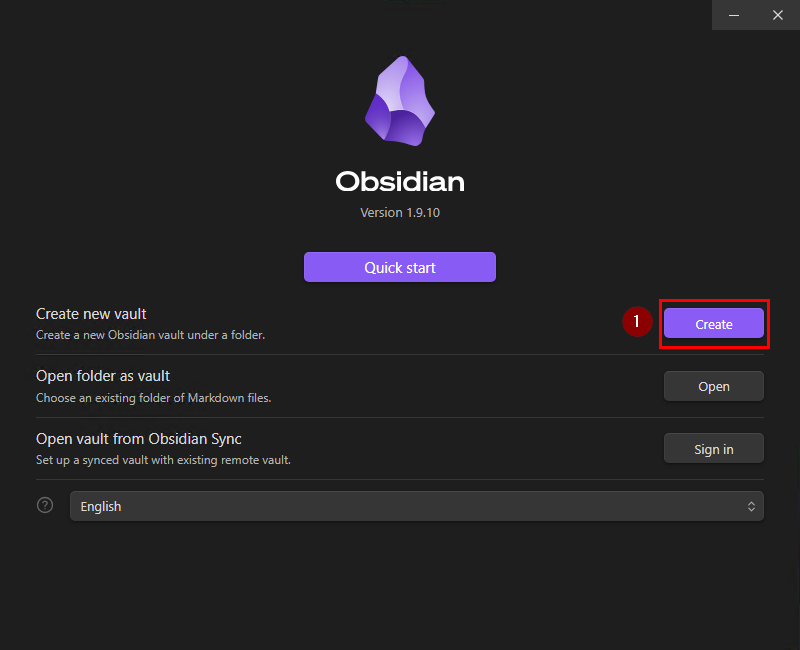
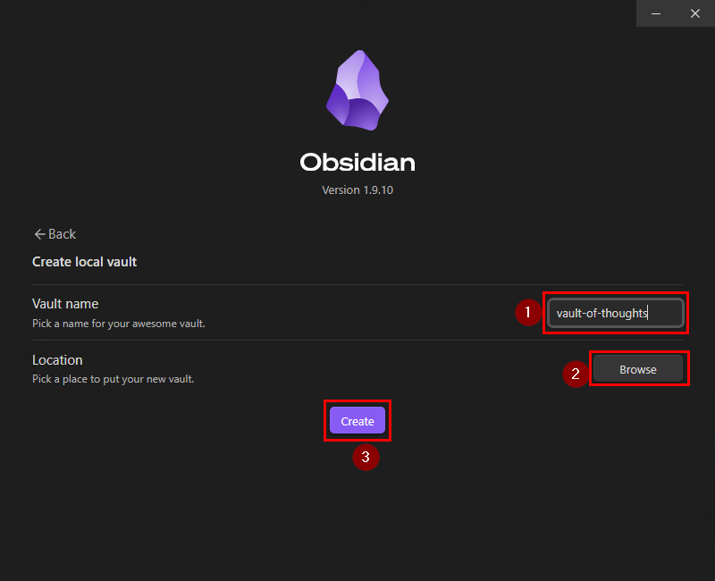
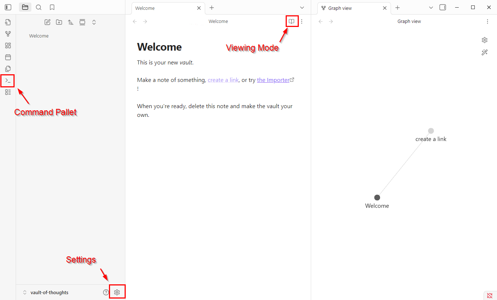
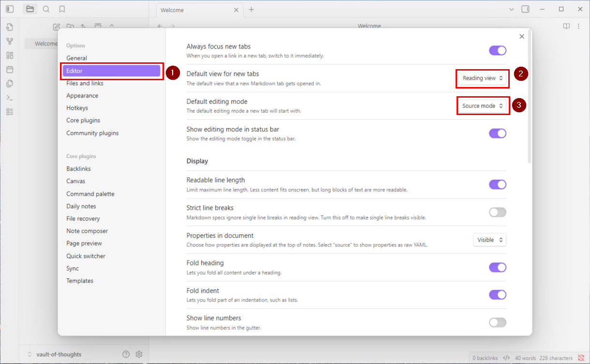
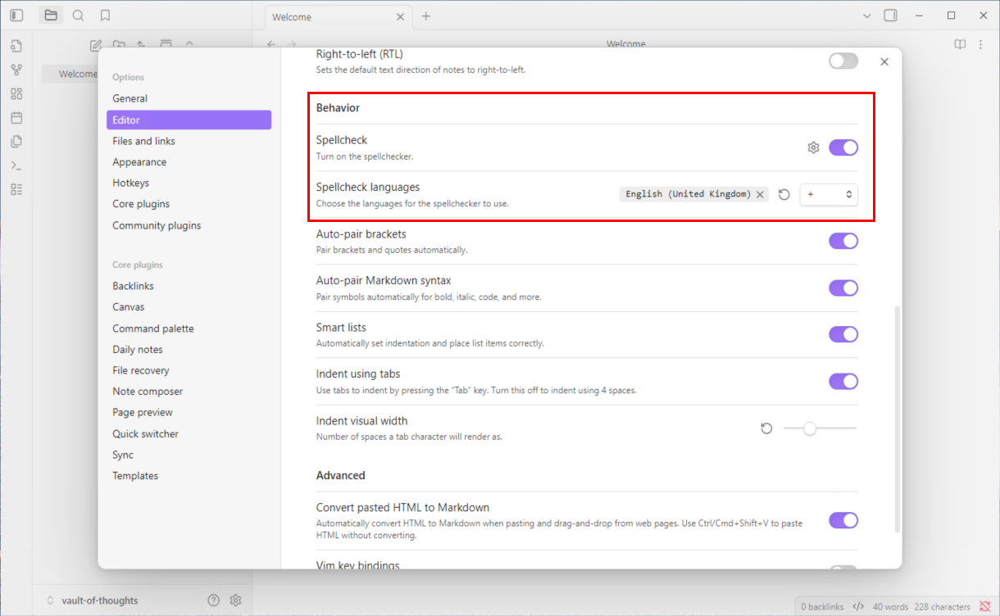

# Obsidian Workshop Guide - Getting Started

This guide will help you follow along during the workshop demonstration. If you get lost during the demo, refer to these steps to catch up.

## Creating Your First Vault

When you first launch Obsidian, you'll see the startup screen with several options.

**For this workshop:**
1. Click **"Create new vault"**
2. **About syncing:** You can back up and sync your Obsidian vault using:
   - Cloud storage (iCloud, Google Drive, Dropbox, etc.) for cross-device access
   - Git repositories (if you're familiar with version control)
   - Obsidian Sync (official paid service): [https://obsidian.md/pricing](https://obsidian.md/pricing)

### Setting Up Your Vault

1. **Give your vault a name** (e.g., "vault-of-thoughts")
2. **Choose a directory** to store your vault
3. Click **"Create"**

## Understanding Key Interface Elements

Once your vault opens, you'll see the main interface. Here are the most important buttons you need to know:

### Essential Controls

- **Settings (⚙️):** Configure and customize Obsidian and its plugins
- **Command Palette (Ctrl/Cmd + P):** Execute commands, tools, and actions quickly
- **View Mode Toggle:** Switch between different viewing modes (we'll cover this next)

### Understanding Viewing Modes

Obsidian has **three viewing modes** that can be confusing at first:

1. **Reading View:** 
   - Read-only display of your formatted notes
   - No editing capabilities
   - Clean, distraction-free reading experience

2. **Live Preview:** 
   - Edit and see formatting simultaneously
   - Shows formatted text with minimal Markdown syntax
   - Real-time rendering as you type

3. **Source Mode:** 
   - Shows all raw Markdown syntax
   - Traditional plain-text editing experience
   - Full control over Markdown formatting

> **Why this matters:** Many new users get confused switching between these modes accidentally. Understanding them helps you stay oriented.

## Configuring Default Behavior

**For this workshop, we'll simplify the interface** by using only Reading View and Source Mode, avoiding the potentially confusing Live Preview mode.

### Changing Editor Defaults

1. Click the **Settings cog (⚙️)**
2. Navigate to the **"Editor"** tab in the left sidebar
3. Set the following:
   - **"Default view for new tabs":** `Reading view`
   - **"Default editing mode":** `Source mode`

> **Note:** You can change these settings back to `Live preview` after the workshop if you prefer that mode.

### Configuring Spell Check

While we're in settings, let's also configure the spell checker to your preference.

1. In the same **Editor** settings tab
2. Scroll down to the **"Behavior"** section
3. Configure **"Spell check"** according to your preference

## Workshop Tip
Everything in Obsidian is customizable! If you can't find a setting in the core options, there's likely a community plugin that adds the functionality you need.

## Ready to Continue
With these basic settings configured, you're ready to follow along with the rest of the workshop.